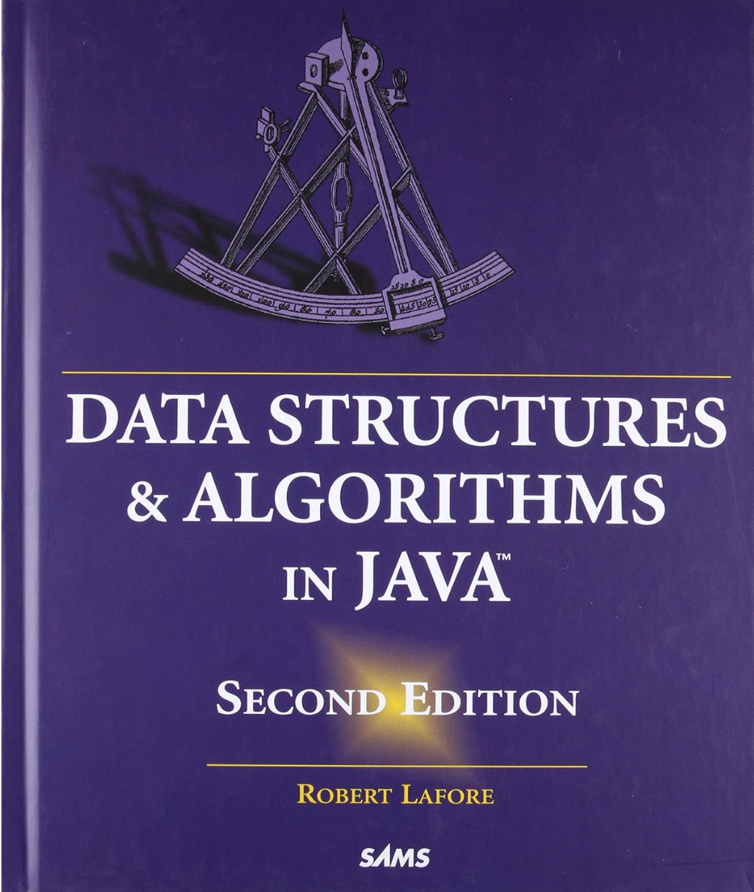

# Learn DSA in Java

The Code and Practices are based on the Book

**"Data Structures & Algorithms in Java, second Edition" by Rober Lafore**

All code are running on [JBang](https://www.jbang.dev).

IDE Extensions:

- [VSCode](https://marketplace.visualstudio.com/items?itemName=jbangdev.jbang-vscode)
- [IntelliJ](https://plugins.jetbrains.com/plugin/18257-jbang)
- [Eclipse](https://marketplace.eclipse.org/content/jbang-eclipse-integration)
- [Others](https://www.jbang.dev/ide/)

## How to read this?

All chapter contents below will be key takeaways from each chapter summary.

The Java Code in each directory respective to the chapter title are my attempts of doing the practices and exercises, or implementing some method in my way.

## Chatpers

### 02 Arrays

- Underorder list: slow search and deletion
- Ordered List: use binary search
- Logrithm: the logarithm to the base B of a number A is (roughly) the number of times you can divide A by B before the result is less than 1.
- Big O (best to worst): **O(1) > O(log N) > O(N) > O(N^2)** 

### 03 Simple Sorting

- Comparing the keys of data items in the array and moving the item until sorted
- Simple sort are all O(N^2)
- All simple sorts are in-place sort
- Invariant in a condition that remains unchanged.
- Bubble sort 
  - outer pointer starts from N-1...N-N and 
  - inner pointer starts from 0...outer
  - swap with the rhs
- Selection Sort
  - outer pointer starts from 0...N-2 ( out < n -1)
  - inner pointer starts from out + 1...N-1
  - set outer pointer as index of the minimum
  - swap if value with inner pointer less than minimum
- Insertion Sort
  - outer pointer starts from 1...N-1
  - Each iteration inner pointer set to outer pointer 
  - Each iteration create a temp with value of outer
  - check when in > 0 and value of lhs of in >= temp
    - if yes, swap, then move inner pointer to the left so temp can replace the lhs
  - set value of inner (--in or in) to temp
### 04 Stack & Queues

### 05 Linked Lists

### 06 Recusion

### 07 Advance Sorting

### 08 Binary Trees

### 09 Red-Black Trees

### 10 2-3-4 Trees and External Storage

### 11 Hash Tables

### 12 Heaps

### 13 Graphs

### 14 Weighted Graphs

### 15 When to Use What
